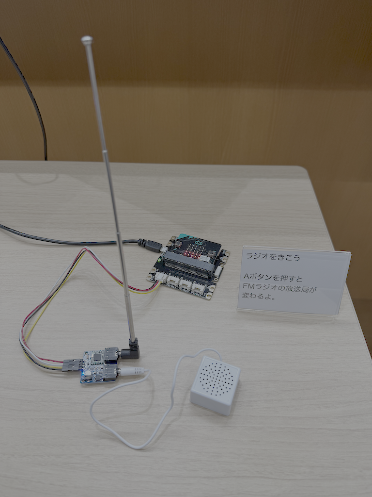
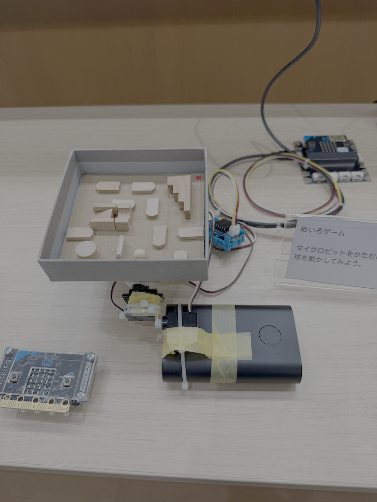
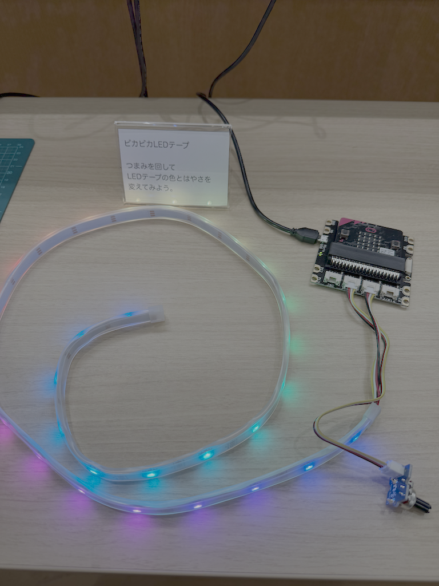
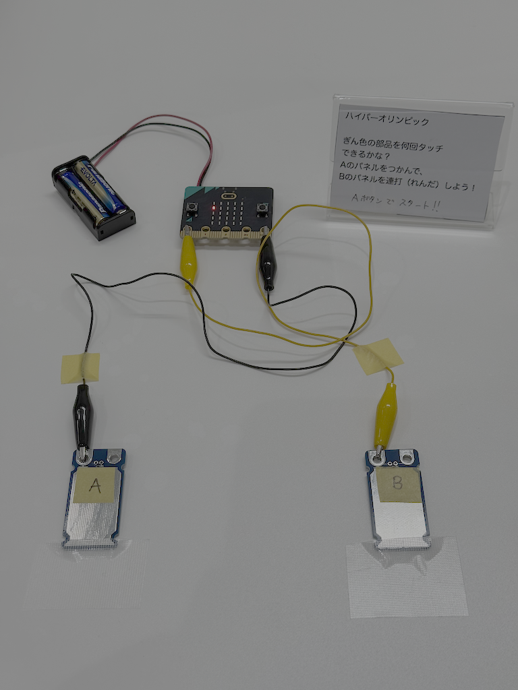

# ワークショップで展示するデモの情報

## ドラムパッド
### プログラム
https://makecode.microbit.org/_Vrw4amaeY1MA  

### 使用機材
* micro:bit用GROVEシールド v2.0: https://www.switch-science.com/collections/micro-bit/products/5434  
* Seeed 12 key capacitive I2C touch sensor V3: https://www.switch-science.com/products/6796  
* eVY1シールド: https://evy1.aides-tech.com/  

### 接続方法
https://github.com/toyowata/drum-pad-microbit

## FMラジオ受信機
### プログラム
https://makecode.microbit.org/_ioX785LbbDLv  

オリジナルコード： https://github.com/toyowata/fm-receiver-rda5807  

### 使用機材
* KKHMF 5V TEA5767: https://www.amazon.co.jp/dp/B07RDQNHZ3  
* micro:bit用GROVEシールド v2.0: https://www.switch-science.com/collections/micro-bit/products/5434  
* GROVE - 4ピン-ジャンパメスケーブル (5本セット): https://www.switch-science.com/products/1048  
* 小型スピーカー

### 接続方法

## リモコンロボット
### プログラム
本体（受信側）: https://makecode.microbit.org/_VbTLgXiak7zs  
リモコン（送信側）: https://makecode.microbit.org/_D7hRbMdx1Ry9  
注意：通信チャネルを同じにすること

### 使用機材
* カムプログラムロボット工作セット: https://www.tamiya.com/japan/products/70227/index.html  
* ツイストクローラー工作セット(2chリモコン): https://www.tamiya.com/japan/products/70233/index.html  
* アームクローラー工作セット(2chリモコンタイプ): https://www.tamiya.com/japan/products/70228/index.html  
### 作り方
https://toyowata.hatenablog.com/entry/2018/06/02/130413

## 迷路ゲーム
### プログラム
本体（受信側） https://makecode.microbit.org/_ahK9k9iAKho1  
リモコン（送信側）https://makecode.microbit.org/_PDVCFoWohHFd  
注意：通信チャネルを同じにすること
### 使用機材
* micro:bit用GROVEシールド v2.0: https://www.switch-science.com/collections/micro-bit/products/5434  
* GROVEプロトシールド: https://www.switch-science.com/products/799
* サーボモーター（2個）
### 接続方法

## ピカピカLEDテープ
### プログラム
https://makecode.microbit.org/_cDV7kzc45F05  

### 使用機材
* micro:bit用 GROVE Inventor Kit: https://www.switch-science.com/collections/micro-bit/products/3389  

### 接続方法

## ハイパーオリンピック
### プログラム
https://makecode.microbit.org/_7CL6JCA9z9wk
### 使用機材
* micro:bit用タッチパッド: https://www.switch-science.com/products/5281  
* micro:bit v2.x （内蔵スピーカー使用）
### 接続方法

## 方位磁針
### プログラム
https://makecode.microbit.org/_4FsdYdczkPjf  
### 使用機材
* micro:bit用 ZIP halo HD: https://www.switch-science.com/products/6161  

## 踏切
### プログラム
STOP-bit: https://makecode.microbit.org/_02tdYX5cCPr7  
Access-bit: https://makecode.microbit.org/_1EiUstRg3PjX  
### 使用機材
* STOP-bit: https://www.switch-science.com/products/4031  
* Access-bit: https://www.switch-science.com/products/5945  
