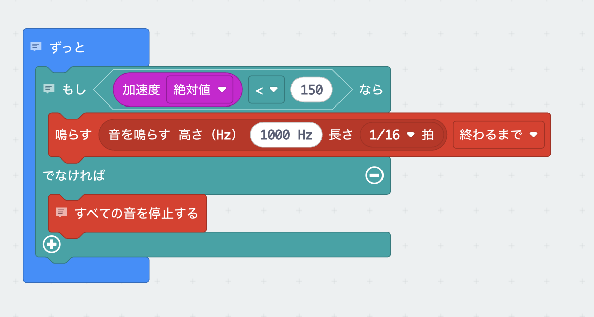

# 落ちる力をはかろう

## むずかしさ　★★☆☆☆

## 使うもの
1. マイクロビット本体
2. <ruby>電池<rp>(</rp><rt>でんち</rt><rp>)</rp></ruby>ボックス

## プログラム

プロジェクト： https://makecode.microbit.org/_VzE51Pb3AYxa

## 作り方

1. <ruby>`加速度`<rp>(</rp><rt>かそくど</rt><rp>)</rp></ruby>ブロックは、`入力`メニューにあります
2. 音の高さには数字を入れます
2. プログラムをマイクロビットに書きこみます

## 使い方

* マイクロビット本体を上から落とすと、落ちている間だけ音が鳴ります
* <ruby>床<rp>(</rp><rt>ゆか</rt><rp>)</rp></ruby>に落とさないように気をつけて
