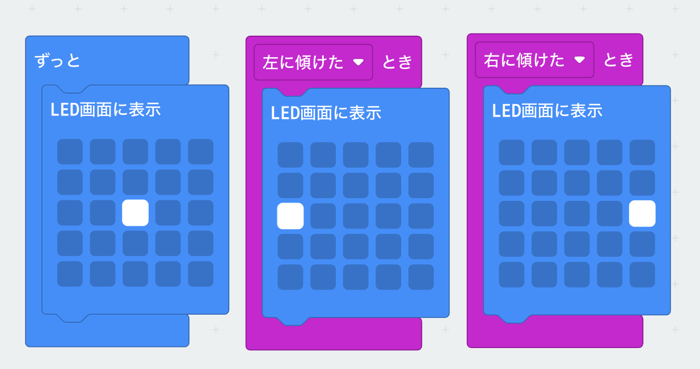

# センサーのプログラム（１）

## プログラム

## 作り方

1. `LED画面に`<ruby>`表示`<rp>(</rp><rt>ひょうじ</rt><rp>)</rp></ruby>ブロックは、<ruby>`基本`<rp>(</rp><rt>きほん</rt><rp>)</rp></ruby>メニューにあります
2. `左に`<ruby>`傾`<rp>(</rp><rt>かたむ</rt><rp>)</rp></ruby>`けたとき`ブロックは、`入力`メニューの`ゆさぶられたとき`のブロックを使います
