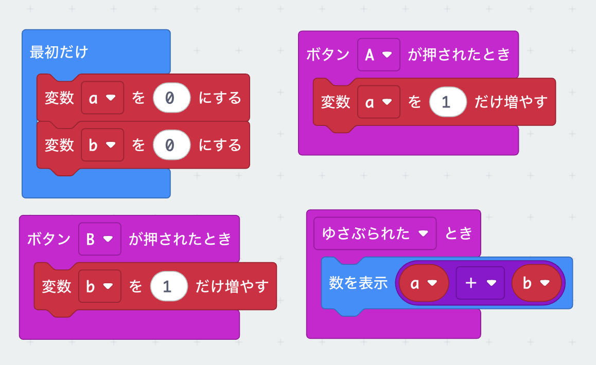
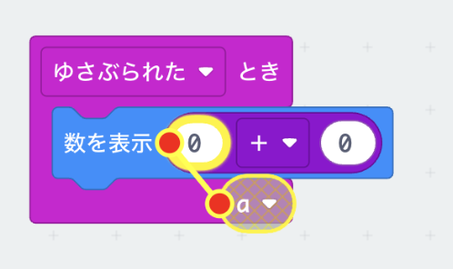

# 計算のプログラム

## プログラム

## 作り方

1. <ruby>`変数`<rp>(</rp><rt>へんすう</rt><rp>)</rp></ruby>メニューから、<ruby>`変数`<rp>(</rp><rt>へんすう</rt><rp>)</rp></ruby>`を`<ruby>`追加`<rp>(</rp><rt>ついか</rt><rp>)</rp></ruby>`する...`を<ruby>選<rp>(</rp><rt>えら</rt><rp>)</rp></ruby>んで、`a`と`b`という名前の<ruby>変数<rp>(</rp><rt>へんすう</rt><rp>)</rp></ruby>を作ります

2. `数を`<ruby>`表示`<rp>(</rp><rt>`ひょうじ`</rt><rp>)</rp></ruby>ブロックの中は、`計算`メニューから`0 + 0`というブロックを<ruby>選<rp>(</rp><rt>えら</rt><rp>)</rp></ruby>んで、そこに<ruby>変数<rp>(</rp><rt>へんすう</rt><rp>)</rp></ruby>をかさねます

